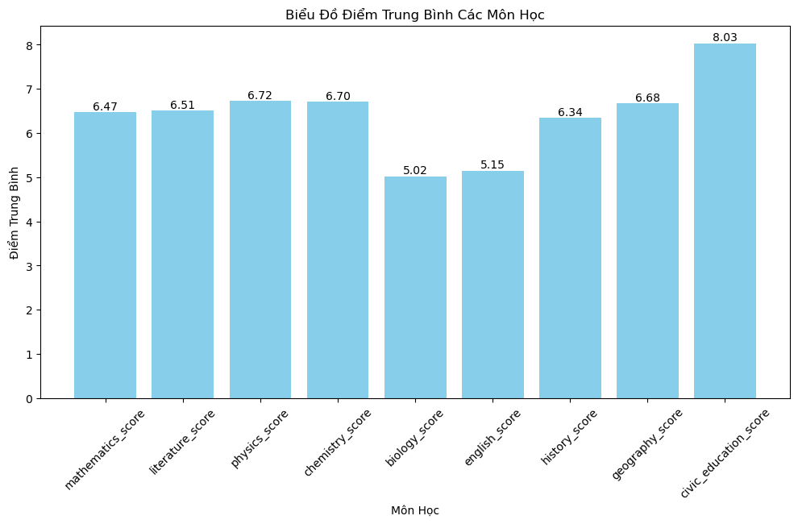

```python
import pandas as pd
import numpy as np
import matplotlib.pyplot as plt
from scipy.cluster.hierarchy import dendrogram, linkage

# Đọc dữ liệu của file CSV vào trong DataFrame
df = pd.read_csv("../Desktop/countries_filtered.csv")

# Gộp kinh độ và vĩ độ thành tọa độ
coordinates = df[['latitude', 'longitude']].values

# Tạo biểu đồ phân tán
plt.figure(figsize=(30, 15))
plt.scatter(x='longitude', y='latitude', data=df)

# Add country labels
for i, row in df.iterrows():
    plt.annotate(row['name'], (row['longitude'], row['latitude']), textcoords="offset points", xytext=(0,10), ha='center')

plt.title('Biểu đồ phân tán tọa độ các nước châu Á và Âu')
plt.xlabel('Kinh độ')
plt.ylabel('Vĩ độ')
plt.show()

```


    

    


```python
import pandas as pd
import numpy as np
import matplotlib.pyplot as plt
from scipy.cluster.hierarchy import dendrogram, linkage

# Đọc dữ liệu của file CSV vào trong DataFrame
df = pd.read_csv("../Desktop/countries_filtered.csv")

# Gộp kinh độ và vĩ độ thành tọa độ
coordinates = df[['latitude', 'longitude']].values

# Thực hiện phân cụm phân cấp
linked = linkage(coordinates, 'ward')

# Vẽ ra sơ đồ dendrogram
plt.figure(figsize=(30, 40))
dendrogram(linked,
           orientation='left',
           labels=df['name'].tolist(),
           distance_sort='descending',
           show_leaf_counts=True,
           leaf_font_size=12,
           above_threshold_color='b',
           color_threshold=80.0)
plt.title('Phân cụm dựa theo kinh và vĩ độ của các nước Á và Âu', fontsize=30)
plt.xlabel('Khoảng cách', fontsize=30)
plt.ylabel('Các nước',fontsize=30)
plt.xticks(rotation=90)
plt.tight_layout()
plt.show()
```


    

    


```python
import pandas as pd
import matplotlib.pyplot as plt

# Đọc dữ liệu từ tệp CSV
df = pd.read_csv('../Desktop/2021.csv')

# Loại bỏ cột 'id' và chuyển đổi các giá trị rỗng thành NaN
df = df.iloc[:, 1:]

# Lấy danh sách các môn học từ tên cột
subjects = df.columns

# Tính điểm trung bình của từng môn học
avg_scores = df.mean()

# Vẽ biểu đồ cột
plt.figure(figsize=(12, 6))
bars = plt.bar(subjects, avg_scores, color='skyblue')
plt.title('Biểu Đồ Điểm Trung Bình Các Môn Học')
plt.xlabel('Môn Học')
plt.ylabel('Điểm Trung Bình')
plt.xticks(rotation=45)

# Hiển thị điểm trung bình ở đầu mỗi cột
for bar, avg_score in zip(bars, avg_scores):
    plt.text(bar.get_x() + bar.get_width() / 2, avg_score, f'{avg_score:.2f}', ha='center', va='bottom')

plt.show()

```


    

    


```python
import pandas as pd
import matplotlib.pyplot as plt

# Đọc dữ liệu từ tệp CSV
df = pd.read_csv('../Desktop/2021.csv')

# Loại bỏ cột 'id' và chuyển đổi các giá trị rỗng thành NaN
df = df.iloc[:, 1:]
df = df.notnull().astype('int')  # Chuyển các giá trị thành 0 (nếu rỗng) hoặc 1 (nếu có giá trị)

# Lấy danh sách các môn học từ tên cột
subjects = df.columns

# Tính tổng số thí sinh thi từng môn học
total_students = df.sum()

# Vẽ biểu đồ cột
plt.figure(figsize=(12, 6))
plt.bar(subjects, total_students, color='skyblue')
plt.title('Số Lượng Thí Sinh Thi Từng Môn Học')
plt.xlabel('Môn Học')
plt.ylabel('Số Lượng Thí Sinh')

# Hiển thị số thí sinh ở đầu mỗi cột
for i, v in enumerate(total_students):
    plt.text(i, v, str(v), ha='center', va='bottom')

plt.xticks(rotation=45)
plt.show()

```


    

    


```python
import pandas as pd
import numpy as np
from scipy.cluster.hierarchy import linkage, dendrogram
import matplotlib.pyplot as plt

# Đọc dữ liệu từ tệp CSV hoặc nguồn dữ liệu khác
df = pd.read_csv('../Desktop/2021.csv')

# Điền giá trị NaN bằng 0
df = df.fillna(0)

# Lấy các cột chứa điểm số (loại bỏ cột 'id')
X = df.iloc[:, 1:]
# print(X)

# Lấy tên các môn học
subject_names = X.columns.tolist()
# print(subject_names)

# Chuyển DataFrame thành mảng NumPy và chuyển vị ma trận (transpose)
X = X.values.T
# print(X)

# Tính ma trận liên kết
linkage_matrix = linkage(X, method='ward')

# Vẽ dendrogram với tên môn học
plt.figure(figsize=(12, 8))
dendrogram(linkage_matrix, labels=subject_names)
plt.xlabel('Môn học')
plt.ylabel('Khoảng cách')
plt.title('Phân cụm phân cấp theo điểm môn học')
plt.xticks(rotation=90)  # Xoay tên môn học để hiển thị dễ đọc
plt.show()

```


    

    


```python

```
